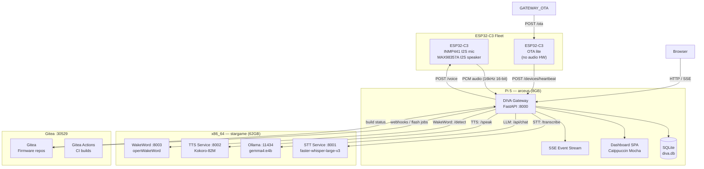
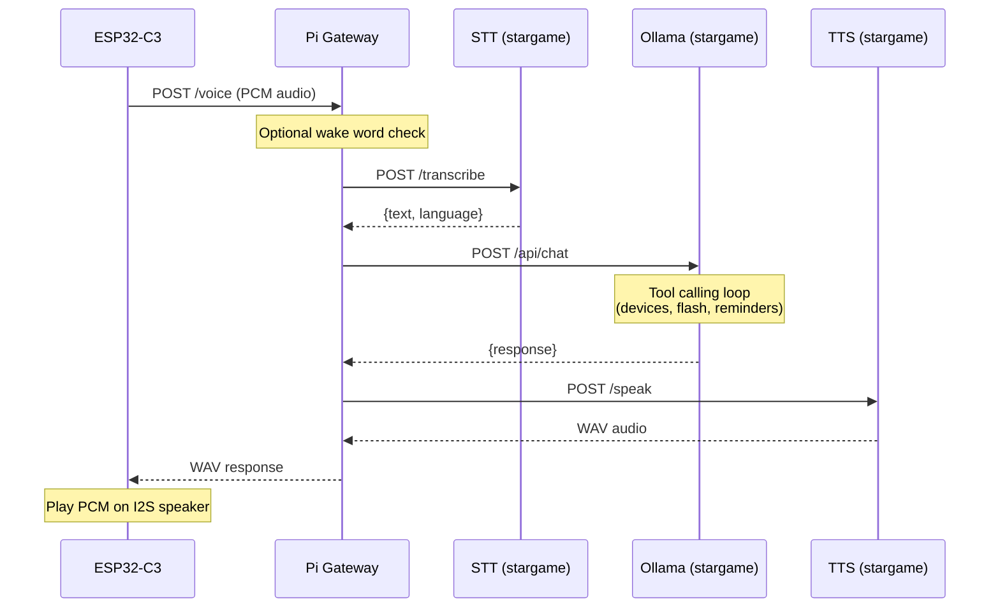

# Architecture

## Voice Pipeline

## Deployment Topology

| Machine | Role | Specs | Services |
|---------|------|-------|----------|
| **arceus** | DIVA Gateway | Pi 5, 8GB RAM | FastAPI gateway, SQLite, Dashboard SPA |
| **stargame** | Inference node | x86_64, 62GB RAM | STT (:8001), TTS (:8002), WakeWord (:8003), Ollama (:11434) |
| **stargame** | Code hosting | (same machine) | Gitea (:30529), Gitea Actions |
